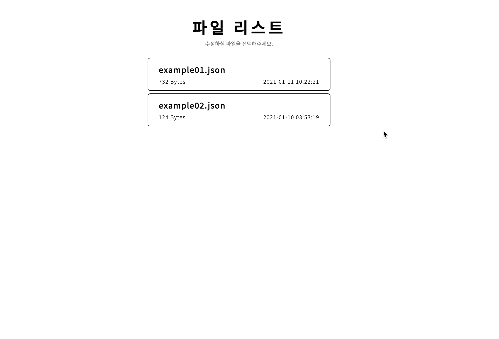

# Local JSON File Editor
`server/files` 디렉토리 내 JSON 파일을 불러와 수정할 수 있는 에디터입니다. 
JSON 파일 내 데이터 구조에 상관없이 수정하실 수 있습니다.

### Editor View

### Reference
- [fs module-JSON](https://heynode.com/tutorial/readwrite-json-files-nodejs)